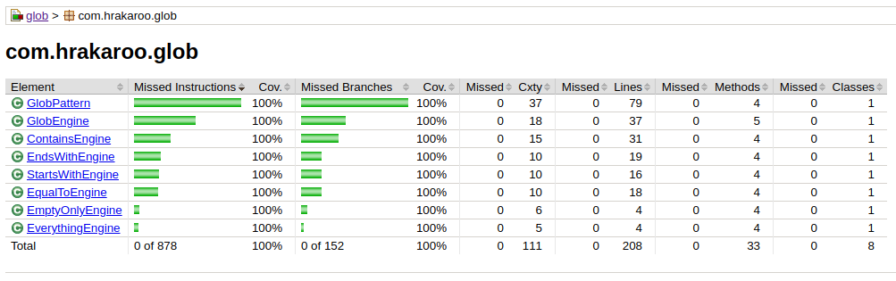

# glob-library

Library for glob searching in strings.

## Why

Most implementations for glob searching try to rewrite the glob as a regular expression.
Although rewriting as a regular expression is _possible_ this library strives to be both,
safer and faster.

### What is a glob?

A glob is a very basic type of pattern matching where you use a single
character to say "match anything or nothing".  The Unix command line
supports this by using a `*` and SQL uses a `%`.  Single character 
matches are also supported using '?' and '_' respectively.  Glob patterns
are no where near as expressive as expressive as full regular expressions.

[Wikipedia](https://en.wikipedia.org/wiki/Glob_(programming)) has more information.

## Features

- Multiple glob patterns are folded into one during compile time.  
- Escaping glob patterns works as expected.  
- Low memory footprint.
- Zero library dependencies (we depend on junit for testing and jmp for benchmarking, but the final
artifact has no dependencies.)
- Compiled matchers are thread safe.

## Usage

As globs don't have any capture syntax (unlike regex) so the usage is even easier
than regex.  The default compile uses '*' for the match anything character, '?' 
for the match one character, is case sensitive and handles escaping.

```
MatchingEngine m = GlobPattern.compile("dog*cat\\*goat??");
if (m.matches(str)) { ... }
```

This will match the following `dog horse cat*goat!~` and `dogcat*goat..`
but not `horse dogcat*goat.` and not `dog catgoat!/`.

We can also change the glob characters so closer resembles SQL LIKE syntax.

```
MatchingEngine m = GlobPattern.compile("dog%cat\%goat_", '%', '_', GlobPattern.HANDLE_ESCAPES);
if (m.matches(str)) { ... }
```

This will match the following `dog horse cat%goat!~` and `dogcat%goat..`
but not `horse dogcat%goat.` and not `dog catgoat!/`.

You can also turn off either the anything or single character matching by using 
`\0` as your matching character.

## Performance

### JMH Run Results

Larger scores are better as they indicate more throughput per second.  For both the globWords and
globLogLines benchmarks the glob pattern has been written specifically to prevent the Glob 
library from using an optimization.

```
Benchmark                                             Mode  Cnt         Score        Error   Units
Benchmark1.globWords                                 thrpt   10        19.460 ±      0.967   ops/s
Benchmark1.greedyRegexWords                          thrpt   10        12.609 ±      0.339   ops/s
Benchmark1.nonGreedyRegexWords                       thrpt   10        13.291 ±      0.303   ops/s
```

For the words file the glob-library is 1.5x faster than both greedy and non-greedy regex.

```
Benchmark                                             Mode  Cnt         Score        Error   Units
Benchmark1.globLogLines                              thrpt   10        10.707 ±      0.204   ops/s
Benchmark1.greedyRegexLogLines                       thrpt   10         8.598 ±      0.247   ops/s
Benchmark1.nonGreedyRegexLogLines                    thrpt   10         8.409 ±      0.162   ops/s
```

For the longer log lines the glob-library is still faster, but not by as much.

```
Benchmark                                             Mode  Cnt         Score        Error   Units
Benchmark1.globCompare                               thrpt   10       179.345 ±      3.151   ops/s
Benchmark1.globCompareCaseInsensitive                thrpt   10       169.957 ±     23.889   ops/s
Benchmark1.stringCompare                             thrpt   10       211.104 ±      3.435   ops/s
Benchmark1.stringCompareCaseInsensitive              thrpt   10       126.214 ±      5.041   ops/s
```

For basic comparision the glob-library is a bit slower than a String.equals and a bit faster for a 
String.equalsIgnoreCase.

## Implementation Details

- Glob matching is non-greedy.
- Automatic optimization uses a string comparision if no globs are found in the pattern.
- Automatic optimization for other common patterns ('\*foo', 'foo\*', '\*foo\*', '\*', '')
- Heavily weighted towards front loading work to the pattern compiler.

## Unit Tests

100% Test code coverage
 


## Notes

Effort has been made to avoid recursion, nested loops and generics,
all of which can have small performance impacts.  I've also specifically
avoided using external libraries (which is also why it is written in
java and not kotlin) so as to minimize dependency conflicts with other
libraries.
